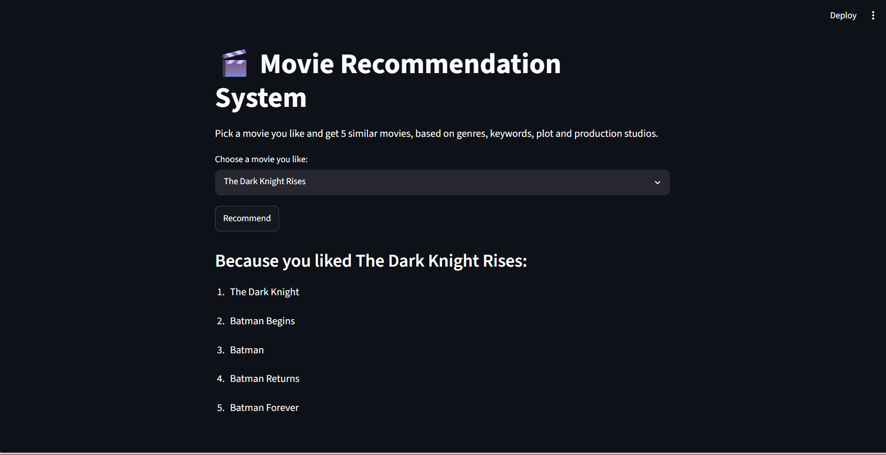
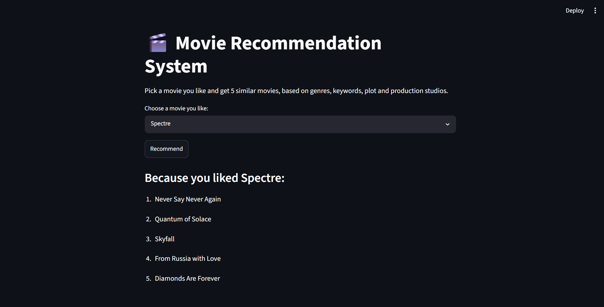

# 🎬 Movie Recommendation System

A content-based movie recommender built with Python and scikit-learn. Pick a movie you like and the app suggests the 5 most similar movies from the TMDB 5000 dataset, using text features and cosine similarity.

## 🚀 Features

- **Content-based filtering**: recommends movies with similar genres, keywords, plot and production studios
- **4,803 movies** from the TMDB 5000 dataset
- **Fast lookups**: the similarity matrix is precomputed once and cached in the app
- **Interactive UI**: searchable movie dropdown in a Streamlit web app

## 🧠 How It Works

1. **Feature extraction**: for each movie, genres, keywords, top 3 production companies, overview and tagline are parsed from the dataset.
2. **Text cleaning**: multi-word names become single tokens (`Science Fiction` → `sciencefiction`) and everything is lower-cased.
3. **Tags**: all features are combined into one "tags" text per movie.
4. **Vectorization**: `CountVectorizer` (top 5,000 words, English stop words removed) turns tags into vectors.
5. **Similarity**: cosine similarity is computed between every pair of movies (a 4,803 × 4,803 matrix).
6. **Recommendation**: for the selected movie, the app returns the 5 highest-scoring other movies.

**Example results**

| You pick | Recommended |
| --- | --- |
| The Dark Knight | The Dark Knight Rises, Batman Begins, Batman Returns, Batman Forever, Batman |
| Toy Story | Toy Story 2, Toy Story 3, … |
| Avatar | Titan A.E., Aliens vs Predator: Requiem, Independence Day, Predators, Jupiter Ascending |

## 📸 Screenshots

| The Dark Knight Rises → Batman films | Spectre → James Bond films |
| --- | --- |
|  |  |

## 🛠️ Tech Stack

| Area | Tools |
| --- | --- |
| Language | Python |
| Data processing | Pandas |
| Machine learning | scikit-learn (CountVectorizer, cosine similarity) |
| Web app | Streamlit |
| Model storage | Pickle |

## 📂 Project Structure

```
Movie-Recommendation-System/
├── app.py                 # Streamlit app: loads the model and shows recommendations
├── build_model.py         # Builds movies.pkl and similarity.pkl from the dataset
├── tmdb_5000_movies.csv   # TMDB 5000 movies dataset
├── screenshots/           # app screenshots used in this README
├── requirements.txt
└── README.md
```

## ⚙️ Getting Started

```bash
git clone https://github.com/Bhukya-jashwanthi/Movie-Recommendation-System.git
cd Movie-Recommendation-System
pip install -r requirements.txt
python build_model.py      # creates movies.pkl and similarity.pkl
streamlit run app.py
```

The `.pkl` model files are generated locally and not committed, because the similarity matrix is about 90 MB.

## 📊 Dataset

[TMDB 5000 Movie Dataset](https://www.kaggle.com/datasets/tmdb/tmdb-movie-metadata) from Kaggle (The Movie Database).

## 🧭 Future Improvements

- Add cast and director features using the TMDB credits dataset
- Show movie posters via the TMDB API
- Try TF-IDF and sentence embeddings for better similarity
- Combine with collaborative filtering for a hybrid recommender
